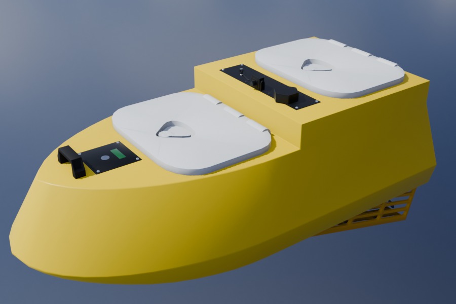
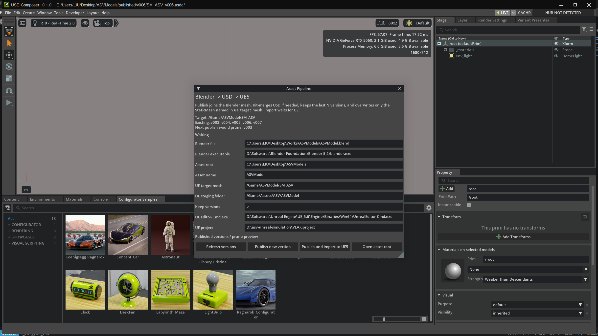

# 面向 ASV 仿真的硬件在环实验平台 - Unreal Engine 端

## 功能接口

| 通道     | 方向          | 说明                            |
| -------- | ----------- | ----------------------------- |
| TCP 8080 | UE → Jetson | CameraFrame 与 ASV / Entity 状态 |
| TCP 8081 | Jetson → UE | BodyFrame 下的二维期望位移指令（包括停机等）   |

## 实现细节

- `HILSimulation` 模块中的 `USceneAutomationSubsystem` 按 Seed 布置环境，实现简单的域随机化
- CameraFrame 由 `UImageCompressionLibrary` 从 SceneCapture RenderTarget 中压缩，模拟视觉传感器

## 资产管理

- 在 Blender 中对 ASV 及其他模型（如目标船）进行建模
- 使用 Omniverse Kit，基于 USD Composer 开发资产管理插件，将 USD 作为中间格式，通过一系列脚本自动覆盖 UE 中的同名网格体
- 在 USD Composer 中检查 USD 模型，并为后续仿真引擎迁移至 Isaac Sim 铺垫 （主要为了 （1）ROS 集成和（2） Isaac Lab 的并行能力）

  
  

## 测试环境

- Windows 11
- Unreal Engine 5.8 (ObjectDeliverer Plugin, Water Plugin)
- Blender 5.2
- USD Composer (Omniverse Kit)
